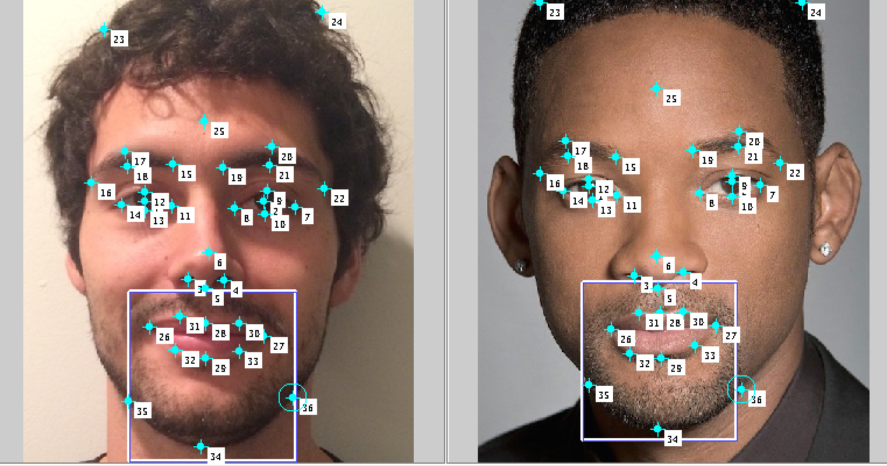
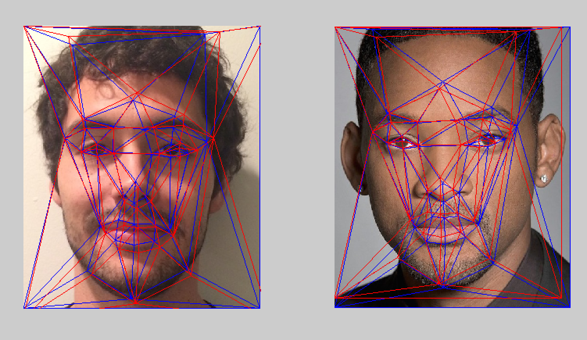
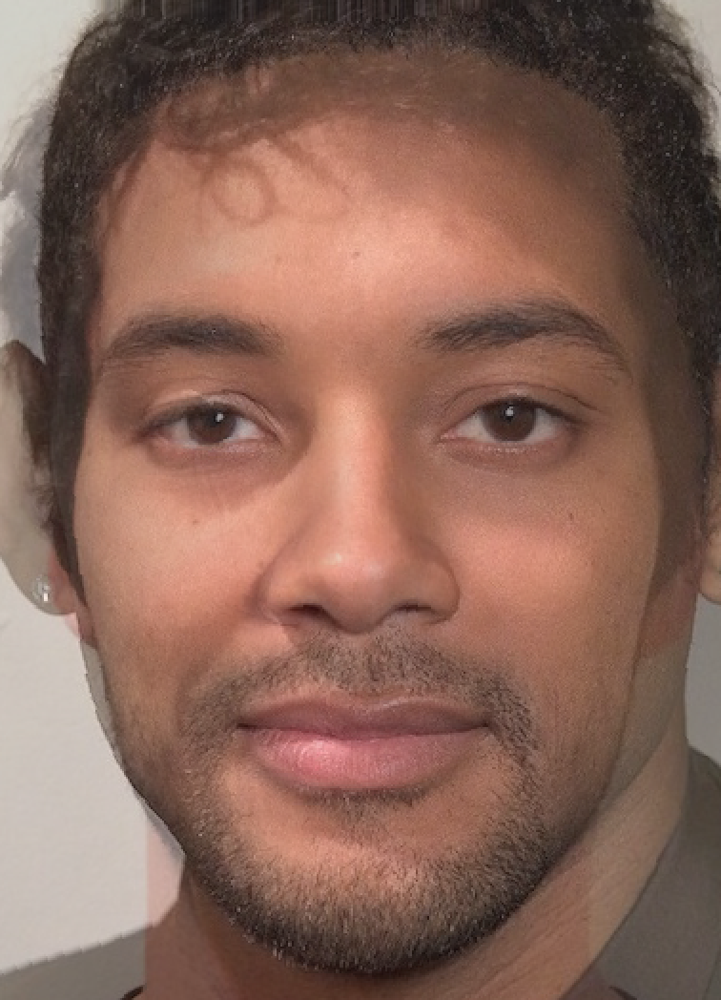

ImageMorphing
=============

Matlab function to create an animation of an image being morphed into another. Works best with faces!

For example, I morphed my face with Will Smith's face.

The funciton first asks for the user to identify corresponding points on both images

Then a Delaunay triangulation is created with the points and the middle or average triangulation is computed. 

The images are then morphed towards the target average triangulation via 2 by a barycentric transformation or via the thin-plate splines method. When computing the midway image, this is the result:

####Check out the videos for a smooth animation from one image to the other!

